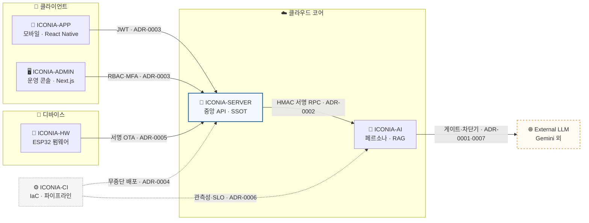

# 🧸 ICONIA · Architecture Decision Records

> **Author:** LEE SEUNG JU · antleorkfl00@naver.com

> **📌 3줄 요약**
> 1. 이 저장소는 **ICONIA**(AI 컴패니언 IoT 인형)를 회로부터 클라우드까지 **6개 저장소**로 설계하며 내린 아키텍처 결정을 모아 둔 **ADR 인덱스**다.
> 2. 각 ADR은 하나의 결정에 대해 **어떤 맥락에서, 어떤 대안을 두고, 무엇을 감수하며 결정했는가**를 기록한다.
> 3. 코드는 결과만 남기므로, ADR로 그 배경과 트레이드오프를 코드 밖에 보존해 **"왜 이 시스템이 이렇게 되어 있는가"**에 답한다.

---

## 🗺️ 시스템 개요

> 핵심 저장소(파란 실선)와 외부 의존(주황 점선)의 관계, 그리고 각 연결에 걸린 결정(ADR)을 한눈에 본다.
> 실선은 **런타임 호출**, 점선(`ICONIA-CI`)은 **배포·운영 파이프라인**을 뜻한다.

---

## 📦 저장소 구성

| 레포 | 역할 | 관련 ADR |
|---|---|---|
| `ICONIA-HW` | ESP32 기기(인형) 펌웨어 — 절전·OTA·부팅 보안 | [0005](adr/0005-firmware-anti-rollback.md) |
| `ICONIA-SERVER` | 중앙 API · 단일 진실원천(SSOT) | [0002](adr/0002-signed-rpc-and-ordering.md) · [0003](adr/0003-token-rotation-auth.md) |
| `ICONIA-AI` | 페르소나 · 멀티모달 RAG · 외부 LLM 게이트 | [0001](adr/0001-external-llm-isolation.md) · [0007](adr/0007-multi-llm-routing-rag.md) |
| `ICONIA-APP` | 사용자 모바일 앱 (React Native) | [0003](adr/0003-token-rotation-auth.md) |
| `ICONIA-ADMIN` | 운영자 콘솔 (Next.js) | [0003](adr/0003-token-rotation-auth.md) |
| `ICONIA-CI` | IaC · 무중단 배포 · 관측성 | [0004](adr/0004-zero-downtime-deploy.md) · [0006](adr/0006-observability-slo.md) |

---

## 📑 결정 목록 (Index)

각 문서는 **맥락 → 결정 → 고려한 대안 → 결과** 순으로 구성된다.

| # | 결정 | 맥락(문제) | 트레이드오프(감수한 비용) | 도메인 |
|---|---|---|---|---|
| [0001](adr/0001-external-llm-isolation.md) | 외부 LLM 의존을 단일 게이트로 격리 | 외부 AI 장애가 서비스 전체로 전파 | 정상 시 한 홉 지연 ↑ | 가용성 |
| [0002](adr/0002-signed-rpc-and-ordering.md) | 서비스 간 호출을 서명 RPC + 순서 보장 | 내부 호출 위·변조·재전송·순서 붕괴 | 처리량 ↓ · 시계 동기화 요구 | 보안·메시징 |
| [0003](adr/0003-token-rotation-auth.md) | 토큰 회전 + 재사용 감지로 탈취 방어 | refresh 토큰 탈취 시 장기 악용 | 클라이언트 재발급 처리 복잡도 ↑ | 보안·인증 |
| [0004](adr/0004-zero-downtime-deploy.md) | 5계층 무중단 배포 + 자동 롤백 | 수동 배포 실수·다운타임·느린 롤백 | 파이프라인 구축비 · 배포 시간 ↑ | 배포·운영 |
| [0005](adr/0005-firmware-anti-rollback.md) | 펌웨어를 되돌리기 불가능하게 3중 방어 | OTA로 옛 취약 펌웨어 강제 설치·위조 | eFuse 비가역 → 버전 실수 시 복구 불가 | 임베디드·보안 |
| [0006](adr/0006-observability-slo.md) | 관측성 + SLO 기반 운영 | 장애를 사후에야 인지, 복구 지연 | 계측·수집 인프라·카디널리티 비용 | 운영·SRE |
| [0007](adr/0007-multi-llm-routing-rag.md) | 멀티-LLM 라우팅 + RAG 폴백 | 단일 모델 장애·환각·비용 변동 | 라우팅·검증 계층 복잡도 ↑ | AI·비용 |

---

## 🏷️ 상태값

ADR은 아래 상태 중 하나를 가진다.

| 상태 | 의미 |
|---|---|
| `Proposed` | 검토 중 |
| `Accepted` | 적용 중 |
| `Deprecated` | 비권장 |
| `Superseded by ADR-XXXX` | 다른 ADR로 대체됨 |

---

✍️ <b>ADR 작성 규칙</b> (펼쳐 보기)

 

- 하나의 ADR은 **하나의 결정**만 다룬다.
- 채택된 ADR은 수정하지 않는다 — 결정이 바뀌면 새 ADR을 만들고 이전 것을 `Superseded`로 표시한다.
- **Consequences(결과)에는 부정적 영향·감수한 비용을 반드시 함께 적는다.**
- 새 ADR은 [`template.md`](template.md)를 복사해 `adr/000N-제목.md` 로 추가한다.

