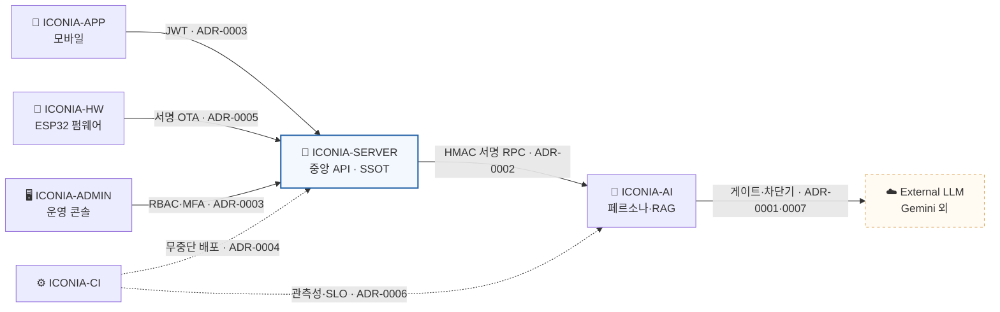

# ICONIA · Architecture Decision Records

> **작성자 / Author — LEE SEUNG JU** · Software / System Architect · antleorkfl00@naver.com

   

**한 제품(ICONIA, AI 컴패니언 IoT 인형)을 회로부터 클라우드까지 6개 저장소로 설계하며 내린 핵심 결정을,
“왜 그렇게 했는가 · 무엇을 포기했는가”로 남긴 의사결정 기록입니다.**

코드는 *결과*만 보여줍니다. 이 저장소는 **판단 과정** — 어떤 제약 앞에서, 어떤 대안을 저울질하고,
무엇을 감수하며 결정했는지를 보여줍니다. **아키텍트가 실제로 하는 일**이 여기 있습니다.

---

## 🎯 이 저장소가 증명하는 것 (채용 담당자용 3줄)

- **트레이드오프로 사고한다** — 모든 결정에 *고려한 대안*과 *감수한 비용*이 명시돼 있습니다. “최신 기술을 썼다”가 아니라 “이 문제 때문에 이걸 택하고 저걸 포기했다”.
- **실패를 먼저 설계한다** — 7개 중 다수가 장애·탈취·위조·다운타임 등 **‘안 될 때’를 가정한 방어 설계**입니다.
- **회로부터 클라우드까지 잇는다** — 펌웨어(eFuse·Secure Boot)부터 분산 백엔드(서명 RPC·SQS FIFO)·배포(무중단 5계층)·AI(LLM 격리)까지 **전 계층의 경계를 직접 설계**했습니다.

---

## 🗺️ 시스템 한눈에 — 어떤 결정이 어디를 지키나

---

## 📋 의사결정 매트릭스

| # | 결정 | 무엇이 문제였나 | 무엇을 감수했나 (트레이드오프) | 도메인 |
|---|---|---|---|---|
| [0001](adr/0001-external-llm-isolation.md) | **외부 LLM 의존을 단일 게이트로 격리** | 외부 AI 장애가 서비스 전체 장애로 전파 | 정상 시 한 홉 지연 ↑ | 가용성 |
| [0002](adr/0002-signed-rpc-and-ordering.md) | **서비스 간 호출을 서명 RPC + 순서 보장** | 내부 호출 위·변조·재전송·순서 붕괴 | 처리량 ↓ · 시계 동기화 요구 | 보안·메시징 |
| [0003](adr/0003-token-rotation-auth.md) | **토큰 회전 + 재사용 감지로 탈취 방어** | refresh 토큰 탈취 시 장기 악용 | 클라이언트 재발급 처리 복잡도 ↑ | 보안·인증 |
| [0004](adr/0004-zero-downtime-deploy.md) | **5계층 무중단 배포 + 자동 롤백** | 수동 배포 실수·다운타임·느린 롤백 | 파이프라인 구축비 · 배포 시간 ↑ | 배포·운영 |
| [0005](adr/0005-firmware-anti-rollback.md) | **펌웨어를 되돌리기 불가능하게 3중 방어** | OTA로 옛 취약 펌웨어 강제 설치·위조 | eFuse 비가역 → 버전 실수 시 복구 불가 | 임베디드·보안 |
| [0006](adr/0006-observability-slo.md) | **관측성 + SLO로 ‘느낌’ 아닌 ‘수치’ 운영** | 장애를 사후에야 인지, 복구 지연 | 계측·수집 인프라·카디널리티 비용 | 운영·SRE |
| [0007](adr/0007-multi-llm-routing-rag.md) | **멀티-LLM 라우팅 + RAG 폴백** | 단일 모델 장애·환각·비용 변동 | 라우팅·검증 계층 복잡도 ↑ | AI·비용 |

> 각 ADR은 **맥락 → 결정 → 고려한 대안(표) → 결과·임팩트**로 되어 있어, 5분이면 “이 사람의 판단 방식”이 보입니다.

---

## 📈 이 결정들이 지탱한 시스템 규모

| 지표 | 값 | 의미 |
|---|---|---|
| 저장소 | **6** | 1인이 팀 단위 구조를 단독 설계·운영 |
| API 경로 | **212** | OpenAPI 계약으로 자동 추출·정합성 검증 |
| APP 테스트 | **994** (82 suites) | 회복탄력성·결제 흐름 검증 |
| 프롬프트 인젝션 가드 | **51+** | LLM 공격 표면 차단 |
| 무중단 배포 계층 | **5** | 체크섬→원자적 교체→테스트→헬스체크→자동 롤백 |
| 펌웨어 방어 | **3중** | semver + firmware secure_version + eFuse |

---

## 🔎 채용 담당자가 3분 안에 볼 것

1. **[의사결정 매트릭스](#-의사결정-매트릭스)** — “무엇을 감수했나” 열만 읽어도 트레이드오프 사고가 보입니다.
2. **[ADR-0001](adr/0001-external-llm-isolation.md)** — 외부 의존을 어떻게 ‘무너지지 않게’ 격리하는가 (아키텍트 시그니처 결정).
3. **[ADR-0005](adr/0005-firmware-anti-rollback.md)** — 소프트웨어가 아니라 **하드웨어(eFuse)까지 내려가는** 방어 — 임베디드↔클라우드 폭.

---

## 🧭 ADR을 쓰는 원칙

- 하나의 ADR은 **하나의 결정**만 다룬다.
- 채택된 ADR은 수정하지 않는다 — 결정이 바뀌면 새 ADR을 만들고 이전 것을 `Superseded`로 표시.
- **Consequences(결과)에는 반드시 *부정적 영향·감수한 비용*을 함께 적는다.** (좋은 점만 적힌 결정 기록은 신뢰할 수 없다.)
- 새 ADR은 [`template.md`](template.md)를 복사해 `adr/000N-제목.md` 로 추가.

**상태값**: `Proposed`(검토 중) · `Accepted`(적용 중) · `Deprecated`(비권장) · `Superseded by ADR-XXXX`(대체됨)

---

## 📦 ICONIA 시스템 개요

| 레포 | 역할 | 관련 ADR |
|---|---|---|
| `ICONIA-HW` | ESP32 기기(인형) 펌웨어 — 절전·OTA·부팅 보안 | 0005 |
| `ICONIA-SERVER` | 중앙 API · 단일 진실원천(SSOT) | 0002·0003 |
| `ICONIA-AI` | 페르소나 · 멀티모달 RAG · 외부 LLM 게이트 | 0001·0007 |
| `ICONIA-APP` | 사용자 모바일 앱 (React Native) | 0003 |
| `ICONIA-ADMIN` | 운영자 콘솔 (Next.js) | 0003 |
| `ICONIA-CI` | IaC · 무중단 배포 · 관측성 | 0004·0006 |

---

## 🔗 함께 보기

- **포트폴리오 / 이력서**: 이 결정들이 실제 제품(ICONIA)에서 어떻게 구현됐는지는 아키텍처 포트폴리오 참조
- **GitHub**: [github.com/Leeseungju1991](https://github.com/Leeseungju1991) — ICONIA 6개 저장소(HW·SERVER·AI·APP·ADMIN·CI) 공개

> *“회로부터 클라우드까지 — 제품 하나를 6개 레이어의 계약으로 연결하고 끝까지 책임지는 아키텍트.”*
