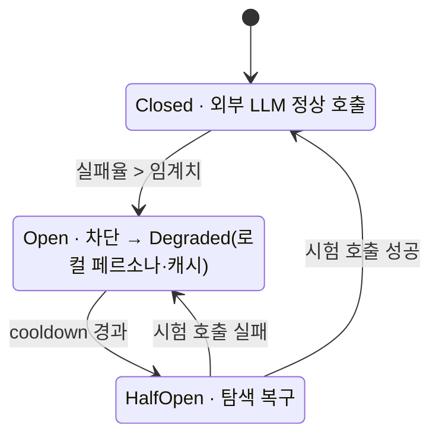

# ADR-0001: 외부 LLM 의존을 단일 게이트로 격리한다

- **상태(Status):** Accepted
- **일자(Date):** 2026-02-10
- **작성자(Author):** LEE SEUNG JU
- **관련 레포:** ICONIA-AI, ICONIA-SERVER
- **태그:** 가용성 · 장애 격리

> **TL;DR** — 외부 LLM을 **단일 게이트**(PersonaClient/RagClient) 뒤에 두고 **차단기 + 지수 백오프 + 기능축소 모드**로 감쌌다. 외부 AI가 죽어도 인형은 계속 반응하고 **기억 손실 0**을 보장한다.

## 맥락 (Context)

ICONIA의 대화 기능은 외부 LLM(Gemini 등)에 의존합니다. 그런데 외부 LLM은 **우리가 통제할 수 없는 구간**입니다.

- 외부 API가 느려지거나(지연 폭증) 5xx를 뱉으면, 그 실패가 **우리 서비스 전체로 그대로 전파**됩니다.
- 인형은 아이가 말을 걸면 **어떤 상황에서도 반응해야** 합니다. “서버 점검 중”은 컴패니언 제품에서 곧 이탈입니다.
- LLM 호출 코드가 여러 곳에 흩어지면, 재시도·타임아웃·키 관리 정책이 제각각이 되어 장애 대응이 불가능해집니다.

## 결정 (Decision)

외부 LLM 호출을 **`PersonaClient` / `RagClient` 라는 단 하나의 게이트**로 일원화하고, 그 게이트에 3중 보호를 넣는다.

1. **장애 자동 차단기(Circuit Breaker)** — 실패율이 임계치를 넘으면 회로를 열어 외부 호출을 즉시 중단하고, 일정 시간 뒤 half-open으로 탐색 복구.
2. **지수 백오프 재시도(Exponential backoff)** — 일시적 오류는 간격을 늘려가며 재시도하되, 상한을 둬 폭주를 막는다.
3. **기능 축소 모드(Degraded mode)** — 외부 LLM이 죽어도 로컬 페르소나/캐시 응답으로 **대화의 연속성과 기억은 유지**한다. 목표는 **기억 손실 0**.

또한 게이트를 지날 때 요청에 **HMAC 서명**을 붙여 내부 신뢰 경계를 명확히 한다.

**차단기 상태 전이 — 외부 LLM이 흔들려도 UX는 흔들리지 않는다:**



```txt
// 게이트 한 곳에 정책이 모인다
askPersona(input):
    if breaker.isOpen(): return degradedReply(memory)      // 기억 기반 폴백
    return retryWithBackoff(maxRetries, () =>
        hmacSigned(llm.call(input)))                        // 서명 + 재시도
    on failure -> breaker.record(); return degradedReply(memory)
```

## 고려한 대안 (Alternatives)

| 대안 | 장점 | 채택하지 않은 이유 |
|---|---|---|
| 각 서비스에서 LLM 직접 호출 | 단순, 지연 최소 | 정책 분산 → 장애 대응 불가, 실패가 전 서비스로 전파 |
| 외부 LLM 하나에만 고정 | 구현 쉬움 | 단일 벤더 장애 = 전체 장애, 협상력 없음 |
| 게이트 + 다중 LLM 라우팅(채택) | 장애 격리·벤더 전환 가능 | 게이트 계층 유지 비용 발생(감수) |

## 결과 (Consequences)

**긍정적**
- 외부 LLM 장애가 **사용자 경험까지 도달하지 않는다.** 차단기가 열려도 인형은 계속 반응한다.
- 재시도·타임아웃·키풀 로테이션 정책이 **한 곳에 모여** 관측·변경이 쉽다.
- 벤더 교체/추가가 게이트 내부 변경으로 끝난다.

**부정적 / 감수한 비용**
- 게이트 계층이 **호출 경로에 한 홉을 추가**해 정상 시 약간의 지연이 생긴다.
- Degraded 응답은 품질이 낮아질 수 있어, **“왜 평소와 다른가”를 UX가 자연스럽게 흡수**해야 한다.
- 차단기 임계치·백오프 파라미터 튜닝이라는 **운영 부담**이 새로 생긴다.

**후속 조치**
- 차단기 open/close, degraded 진입률을 지표화해 대시보드에 노출(→ [ADR-0006](0006-observability-slo.md)).
- LLM별 실패율 기반 자동 라우팅 가중치 도입(→ [ADR-0007](0007-multi-llm-routing-rag.md)).

## 결과 · 임팩트

- 🛡️ **장애 전파 차단**: 외부 LLM의 5xx·지연 폭증이 **사용자 UX까지 도달 0** — 차단기 open 상태에서도 인형은 응답.
- 🧠 **기억 손실 0**: degraded 모드에서 4층 기억 구조 기반으로 대화 연속성 유지.
- 🎛️ **정책 단일화**: 재시도·타임아웃·키풀 로테이션이 **게이트 1곳**에 집중 → 변경·관측 지점이 하나.
- 🔁 **벤더 유연성**: LLM 추가/교체가 게이트 내부 변경으로 끝남(멀티-LLM 라우팅으로 확장 → **[ADR-0007](0007-multi-llm-routing-rag.md)**).
