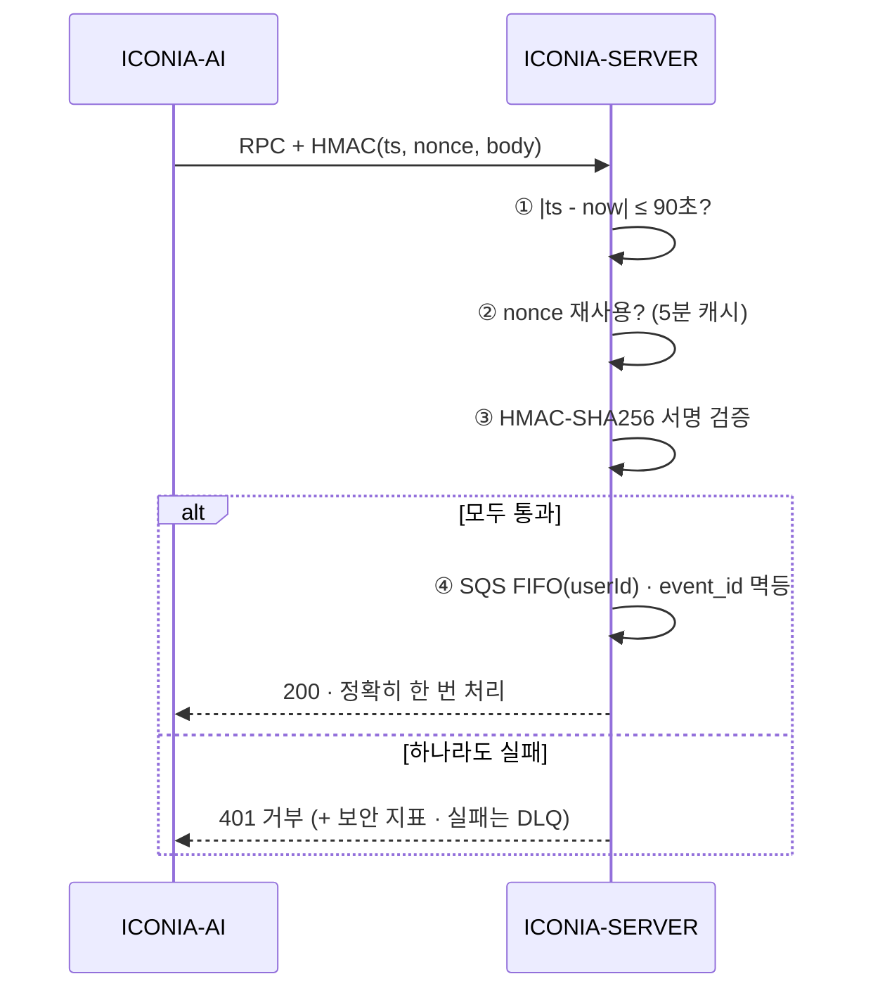

# ADR-0002: 서비스 간 호출을 서명 RPC + 순서 보장으로 계약화한다

- **상태(Status):** Accepted
- **일자(Date):** 2026-02-14
- **작성자(Author):** LEE SEUNG JU
- **관련 레포:** ICONIA-SERVER, ICONIA-AI
- **태그:** 보안 · 시스템 통합 · 메시징

> **TL;DR** — 내부 서비스 호출을 **HMAC 서명(ts+nonce · ±90s · 5분 재전송 캐시)** 으로 위·변조·재전송을 막고, **SQS FIFO + 멱등 event_id**로 사용자별 순서·중복을 구조적으로 없앴다.

## 맥락 (Context)

ICONIA는 6개 저장소가 서로 호출하는 분산 시스템입니다. 서비스 간 통신에는 두 가지 위험이 있었습니다.

- **위·변조·재전송(replay):** 내부 네트워크라도 “신뢰된 내부”를 전제하면, 한 서비스가 뚫렸을 때 위조 요청이 그대로 통합니다. 공격자가 과거 요청을 그대로 다시 보내는 재전송도 막을 수 없습니다.
- **순서 붕괴:** 사용자의 대화·이벤트는 **순서가 의미**입니다. “안녕” → “잘 가”가 뒤바뀌면 대화가 깨집니다. 또 같은 이벤트가 두 번 처리되면 상태가 오염됩니다.

## 결정 (Decision)

서비스 간 호출을 **명시적 계약(contract)** 으로 만든다.

1. **HMAC-SHA256 서명 RPC** — 모든 내부 호출에 서명을 붙인다.
   - 요청마다 **타임스탬프(ts) + 일회용 값(nonce)** 포함.
   - 서버 시계와 **±90초** 밖이면 거부.
   - **5분 재전송 캐시**로 이미 쓴 nonce 재사용을 차단.
2. **사용자별 순서 보장** — 대화·이벤트는 **SQS FIFO**로 흘려 사용자 단위 순서를 보존한다.
3. **멱등 수신(Idempotency)** — 각 이벤트에 `event_id`를 부여해 **같은 요청이 여러 번 와도 한 번만** 처리한다.
4. **실패 격리** — 처리 실패 메시지는 **DLQ(Dead Letter Queue)** 로 보내 본류를 막지 않고 사후 재처리한다.

**한 번의 내부 호출이 통과하는 4중 관문:**

## 고려한 대안 (Alternatives)

| 대안 | 장점 | 채택하지 않은 이유 |
|---|---|---|
| 내부망 신뢰(무서명) | 가장 빠름 | 한 서비스 침해 시 전체 무방비, 재전송 방어 불가 |
| mTLS만 적용 | 전송 구간 암호화 | 애플리케이션 레벨 위·변조/재전송/순서는 못 막음 |
| 표준 큐(비FIFO) | 처리량 높음 | 사용자별 순서 보장 불가 |
| 서명 RPC + FIFO + 멱등(채택) | 위·변조·재전송·순서·중복 모두 해결 | 서명/순서 큐로 처리량·지연 비용 발생(감수) |

## 결과 (Consequences)

**긍정적**
- 내부 호출이 **“누가·언제·무엇을” 검증 가능한 계약**이 된다. 한 서비스가 뚫려도 위조 요청은 통과 못 한다.
- 재전송 공격이 **시계 창(±90s) + nonce 캐시**로 이중 차단된다.
- 대화 순서와 이벤트 중복 문제가 **구조적으로** 사라진다(코드 곳곳의 방어 로직 불필요).

**부정적 / 감수한 비용**
- 서명 생성·검증과 FIFO 큐로 **처리량이 낮아지고 지연이 늘어난다.**
- **시계 동기화(NTP)** 가 인프라 요구사항이 된다. 시계가 틀어지면 정상 요청이 거부될 수 있다.
- nonce 캐시(Redis 등)라는 **상태 저장소 의존**이 추가된다.

**후속 조치**
- 서명 검증 실패·시계 창 밖 요청을 보안 지표로 수집(→ [ADR-0006](0006-observability-slo.md)).
- 키 로테이션 주기와 절차를 별도 ADR로 문서화.

## 결과 · 임팩트

- 🔐 **위조 차단**: 한 서비스가 침해돼도 서명 없는 위조 호출은 통과 불가 — 내부망 신뢰 전제를 제거.
- ⛔ **재전송 무력화**: 시계 창(±90s) + nonce 캐시 이중 방어로 캡처-리플레이 차단.
- 🔢 **순서·중복 소멸**: SQS FIFO + 멱등 event_id로 대화 순서·이벤트 중복이 **구조적으로** 사라짐(방어 코드 산재 불필요).
- 🧯 **장애 격리**: 실패 메시지는 DLQ로 격리돼 본류 처리를 막지 않음.
