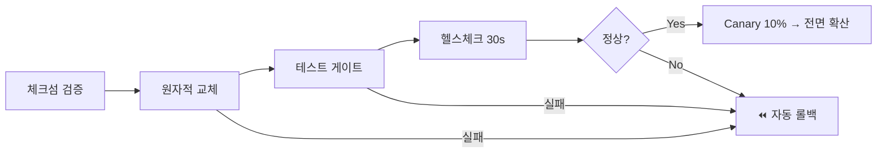

# ADR-0004: 배포를 5계층 무중단 파이프라인으로 자동화한다

- **상태(Status):** Accepted
- **일자(Date):** 2026-02-24
- **작성자(Author):** LEE SEUNG JU
- **관련 레포:** ICONIA-CI
- **태그:** 배포 · 릴리즈 · 운영 안정성

> **TL;DR** — 배포를 체크섬 → 원자적 교체 → 테스트 → 30초 헬스체크 → **자동 롤백**의 5계층 파이프라인으로 만들고 Canary 10% + OIDC 키리스를 더해, 배포를 **‘두렵지 않은 버튼 하나’**로 바꿨다.

## 맥락 (Context)

1인이 6개 저장소를 운영하는 구조에서 **배포가 가장 큰 사고 지점**이었습니다.

- 손으로 배포하면 **실수(잘못된 아티팩트, 설정 누락)** 와 **다운타임**이 반복됩니다.
- 문제가 생겼을 때 **되돌리기(롤백)가 느리면** 장애 시간이 그대로 늘어납니다.
- 컴패니언 제품은 항상 켜져 있어야 하므로 **무중단**이 전제입니다.

핵심 질문: “배포가 **두렵지 않아야** 자주·작게 배포할 수 있다. 어떻게 두려움을 없앨까?”

## 결정 (Decision)

배포를 **5계층 자동 파이프라인**으로 만들고, 실패하면 **사람 개입 없이 되돌린다.**

1. **체크섬 검증** — 배포 아티팩트 무결성 확인(잘못된 빌드 원천 차단).
2. **원자적 교체(atomic swap)** — 새 버전을 준비해 두고 **한 번에** 전환(중간 상태 노출 없음).
3. **테스트 게이트** — 배포 직후 스모크/헬스 테스트를 통과해야 다음 단계로.
4. **헬스체크(30s)** — 실서비스 트래픽에서 30초간 상태를 관찰.
5. **자동 롤백** — 위 단계 중 하나라도 실패하면 이전 버전으로 즉시 복귀.

추가로 **Canary 10% rollout**(새 버전을 10%에만 먼저 노출)과 **OIDC 키리스 인증**(장기 비밀키 없이 배포 권한 획득)을 적용한다.

**어느 단계에서 실패하든 → 자동 롤백으로 수렴한다:**

## 고려한 대안 (Alternatives)

| 대안 | 장점 | 채택하지 않은 이유 |
|---|---|---|
| 수동 배포 | 도구 불필요 | 실수·다운타임·느린 롤백 |
| 단순 재시작 배포 | 구현 쉬움 | 전환 중 다운타임, 실패 시 수동 복구 |
| Blue/Green + Canary + 자동롤백(채택) | 무중단·부분 노출·자동 복구 | 파이프라인 구축·유지 비용(감수) |

## 결과 (Consequences)

**긍정적**
- 배포가 **버튼 하나**가 되어, 작고 잦은 릴리즈가 가능해진다(사고 시 영향 범위 축소).
- 문제가 나도 **자동 롤백**으로 장애 시간이 최소화된다.
- Canary로 **10% 사용자에서 먼저 검증** → 전면 확산 전에 회귀를 잡는다.
- OIDC 키리스로 **장기 비밀키 유출 위험 제거.**

**부정적 / 감수한 비용**
- 파이프라인·헬스체크·롤백 자동화를 **처음에 구축하는 비용**이 든다.
- 배포 시간이 헬스체크(30s)·Canary 관찰만큼 **길어진다**(즉시성↓, 안전성↑ 트레이드오프).
- 원자적 교체·Canary를 위해 **인프라가 두 버전을 동시 수용**할 수 있어야 한다(리소스 여유 필요).

**후속 조치**
- 롤백 발생률·평균 배포 시간·Canary 차단율을 지표화(→ [ADR-0006](0006-observability-slo.md)).
- DB 스키마 변경과 무중단 배포의 호환(확장→수축 마이그레이션) 규칙을 별도 ADR로.

## 결과 · 임팩트

- 🚀 **무중단**: 원자적 교체로 배포 중 다운타임 0, 사용자는 릴리즈를 인지하지 못함.
- ⏪ **자동 복구**: 어느 단계 실패든 사람 개입 없이 이전 버전 복귀 → 장애 시간 최소화.
- 🐤 **회귀 조기 차단**: Canary 10%에서 문제를 잡아 전면 확산 전에 되돌림.
- 🔑 **비밀키 제거**: OIDC 키리스로 장기 배포 크레덴셜 유출 위험 원천 제거.
