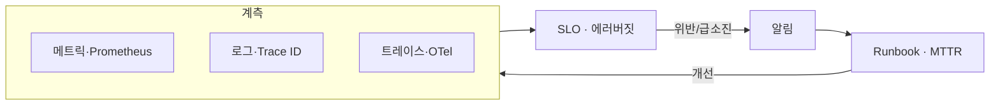

# ADR-0006: 관측성 + SLO로 ‘느낌’이 아니라 ‘수치’로 운영한다

- **상태(Status):** Accepted
- **일자(Date):** 2026-03-04
- **작성자(Author):** LEE SEUNG JU
- **관련 레포:** ICONIA-CI, ICONIA-SERVER, ICONIA-AI
- **태그:** 운영 · SRE · 관측성

> **TL;DR** — 메트릭·로그·트레이스 3축 관측성 위에 **SLO와 에러버짓**을 세워, 장애를 사후가 아니라 **징후 단계에서** 잡는다. 앞선 결정들(차단기·롤백·서명·회전)의 효과도 전부 **수치로** 본다.

## 맥락 (Context)

1인이 6개 저장소를 운영하는 구조에서, **“문제를 언제 아느냐”**가 곧 장애 시간이었습니다.

- 사용자가 알려줘야 아는 운영은 이미 늦습니다. 컴패니언 제품은 **조용한 실패(응답 지연·품질 저하)**가 이탈로 직결됩니다.
- 앞선 ADR들(0001 차단기, 0004 롤백, 0002 서명, 0003 회전)이 **실제로 작동하는지**를 볼 지표가 없으면 설계가 “주장”에 그칩니다.
- “빠르다/느리다”를 감으로 말하면 개선의 우선순위를 정할 수 없습니다.

## 결정 (Decision)

**계측 → 목표(SLO) → 알림 → 대응(Runbook)** 의 닫힌 고리를 만든다.

1. **3축 관측성**
   - **메트릭**: Prometheus — 골든 시그널(지연·트래픽·에러·포화) + ADR 지표(차단기 open율·degraded율·롤백율·서명검증 실패·회전 강제 로그아웃).
   - **로그**: 중앙 수집 + **Trace ID** 로 요청 단위 상관.
   - **트레이스**: OpenTelemetry 로 서비스 간 경로·병목 추적.
2. **SLO + 에러버짓** — 가용성·지연 목표를 명시하고, 에러버짓 소진 속도로 “배포를 멈출지”를 판단.
3. **알림 + Runbook + MTTR** — SLO 위반/버짓 급소진 시 알림 → 대응 매뉴얼(Runbook) 연결 → 평균 복구시간(MTTR) 목표 관리.
4. **공급망 관측** — SBOM · 취약점/시크릿 스캔으로 코드 밖 위험도 상시 가시화.

## 고려한 대안 (Alternatives)

| 대안 | 장점 | 채택하지 않은 이유 |
|---|---|---|
| 로그만 수집 | 간단 | 추세·병목·SLO 판단 불가, 사후 분석에 그침 |
| APM SaaS 전면 도입 | 빠른 시작 | 비용·벤더 종속, 커스텀 ADR 지표 반영 한계 |
| 무계측(감으로 운영) | 0 비용 | 조용한 실패를 놓침 — 채택 불가 |
| 3축 + SLO/에러버짓(채택) | 사전 인지·객관적 배포 판단 | 계측·수집 인프라·카디널리티 비용(감수) |

## 결과 (Consequences)

**긍정적**
- 장애를 **징후 단계**에서 인지 → MTTR 단축.
- SLO/에러버짓으로 **“지금 배포해도 되는가”**를 감이 아니라 데이터로 판단(→ ADR-0004와 연결).
- 앞선 방어 설계들의 **작동 여부를 수치로 확인**.

**부정적 / 감수한 비용**
- 메트릭 카디널리티·로그량에 따라 **저장/쿼리 비용**이 늘어난다.
- 계측 코드·대시보드·알림 규칙을 **유지·튜닝**하는 지속 부담.
- 알림 임계치가 느슨하면 소음, 빡빡하면 피로 — **균형 설계**가 필요.

**후속 조치**
- SLO 목표치·에러버짓 소진 정책을 팀 합의 문서로 고정.
- 알림 → Runbook 매핑 커버리지를 정기 점검.

## 결과 · 임팩트

- 📊 **사전 인지**: 조용한 실패를 징후 단계에서 포착 → 사용자 신고 이전 대응.
- 🧮 **객관적 배포 판단**: 에러버짓 기반으로 릴리즈 게이트 운영(0004와 결합).
- 🔬 **설계 검증**: 차단기·롤백·서명·회전 지표로 “방어가 실제로 작동”하는지 확인.
- 🧷 **공급망 가시성**: SBOM·스캔으로 의존성 취약점까지 상시 관측.
