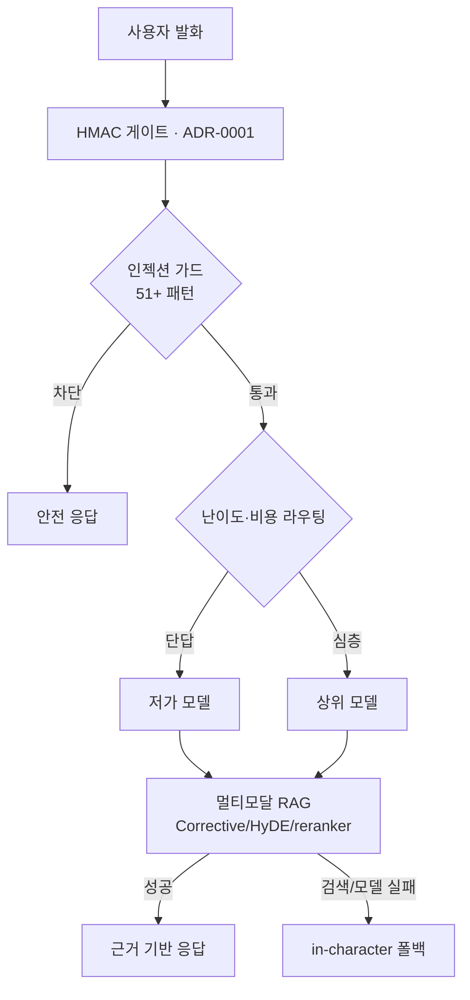

# ADR-0007: 멀티-LLM 라우팅 + RAG 폴백으로 AI를 싸고 강건하게 운영한다

- **상태(Status):** Accepted
- **일자(Date):** 2026-03-08
- **작성자(Author):** LEE SEUNG JU
- **관련 레포:** ICONIA-AI
- **태그:** AI · 비용 · 신뢰성

> **TL;DR** — ADR-0001의 게이트 **뒤에서** 난이도·비용 기반으로 여러 LLM을 라우팅하고, **멀티모달 RAG(Corrective/HyDE/reranker)** 로 근거를 붙여 환각을 줄인다. 검색·모델 실패 시엔 **캐릭터를 유지한 폴백**으로 대화가 끊기지 않는다.

## 맥락 (Context)

ADR-0001로 외부 LLM을 게이트로 격리했지만, **단일 모델 의존** 자체가 또 다른 문제였습니다.

- **품질·비용 편차:** 모든 요청을 최상위 모델로 보내면 **비용이 폭증**하고, 반대로 저가 모델만 쓰면 깊은 대화의 품질이 떨어집니다.
- **환각:** 근거 없이 생성하면 인형이 **사실이 아닌 말**을 지어냅니다(컴패니언 신뢰 훼손).
- **모델 장애:** 특정 벤더/모델의 장애·정책 변경이 대화를 끊습니다.
- **주입 공격:** 사용자가 프롬프트로 시스템 지시를 탈취하려 합니다.

## 결정 (Decision)

게이트 뒤에 **라우팅 + 근거 + 폴백 + 가드**를 계층으로 둔다.

1. **난이도·비용 기반 라우팅** — 단답/간단 질의는 **저가 모델**, 깊은 대화는 **상위 모델**로. 실패율 기반 **지역 failover**로 벤더 장애를 우회.
2. **멀티모달 RAG** — **Corrective RAG · HyDE · reranker** 로 관련 근거를 검색·재정렬해 답변에 붙여 **환각을 저감**.
3. **in-character fallback** — 검색/모델 실패 시에도 **페르소나를 유지한 폴백 응답**으로 대화 연속성 확보(ADR-0001의 degraded와 연결).
4. **LLM 보안 가드** — **51+ 프롬프트 인젝션 패턴 차단 + 25+ 누출 sanitize + 미끼(canary) 토큰**으로 지시 탈취·정보 누출 탐지.
5. **키풀 로테이션** — 다중 API 키를 풀로 돌려 레이트리밋·차단 리스크 분산.

## 고려한 대안 (Alternatives)

| 대안 | 장점 | 채택하지 않은 이유 |
|---|---|---|
| 최상위 모델 하나로 고정 | 품질 일관 | 비용 폭증 · 단일 벤더 장애에 취약 |
| 저가 모델만 사용 | 저비용 | 깊은 대화 품질 저하 |
| RAG 없이 생성만 | 단순 | 환각 통제 불가 |
| 라우팅+RAG+폴백+가드(채택) | 비용↓·강건·환각↓·보안 | 라우팅·검증 계층 복잡도↑(감수) |

## 결과 (Consequences)

**긍정적**
- **비용 최적화**: 요청 난이도에 맞춰 모델을 골라 비용을 크게 낮춤.
- **가용성**: 모델 실패 시 failover + in-character 폴백으로 대화가 끊기지 않음.
- **신뢰성**: RAG 근거로 환각을 줄여 컴패니언 신뢰 유지.
- **보안**: 인젝션 가드·누출 sanitize·canary로 공격 표면 축소.

**부정적 / 감수한 비용**
- 모델마다 **말투·형식이 달라** 페르소나 일관성 관리가 필요(라우팅 경계에서 후처리).
- 라우팅·RAG·가드 **계층이 늘어** 지연·복잡도가 증가.
- RAG 인덱스·리랭커 **품질 유지**가 지속 과제.

**후속 조치**
- 라우팅 정책(난이도 판정 기준)·모델별 실패율을 지표화(→ ADR-0006).
- 인젝션 가드 룰셋을 신규 공격 패턴에 맞춰 정기 갱신.

## 결과 · 임팩트

- 💰 **비용↓**: 단답은 저가·심층은 상위 모델 라우팅으로 운영비 절감.
- 🛟 **강건성**: 모델 failover + 캐릭터 유지 폴백으로 “끊기지 않는 대화”.
- 🧭 **환각 저감**: Corrective/HyDE/reranker 근거 기반 응답.
- 🛡️ **AI 보안**: 51+ 인젝션 가드 · 25+ 누출 sanitize · canary 토큰으로 지시 탈취·누출 탐지.
